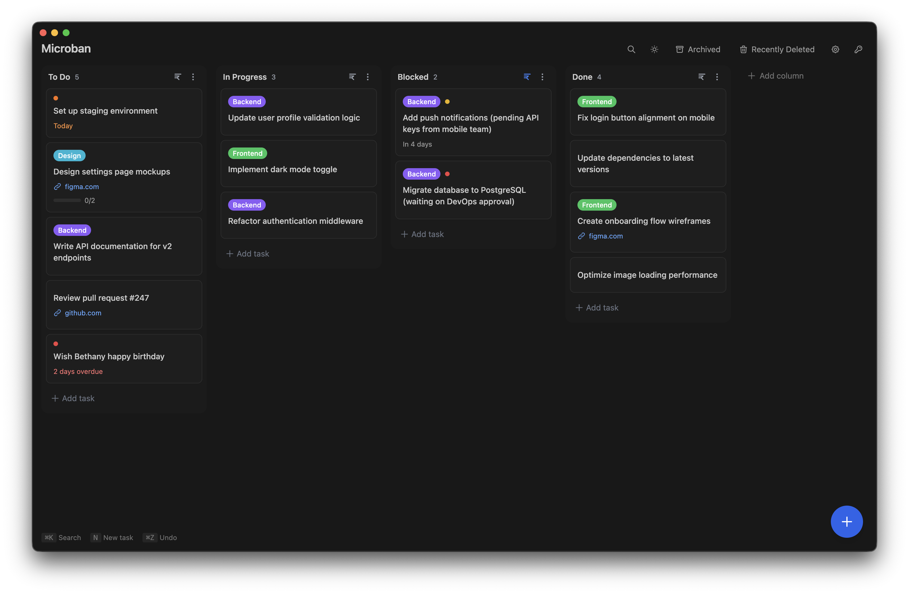

"Make a todo app" is often the first project new developers are advised to work on. It's a simple, relatable project that can help you get your feet wet in whatever ecosystem and languae you choose to use.

Microban was born out of my frustration of not being able to find a proper, simple todo app that had both all the features I wanted (tags, due dates, sorting, search, etc), while also not having all the bloat I didn't want (integrations, automations, AI, etc.). I searched high and low, and found a couple of good options (namely [CmdList](https://apps.apple.com/us/app/cmdlist/id6747479815), [Lunatask](https://lunatask.app/), and [Notion](https://www.notion.com/)) but none struck the right balance of simplicty and feature richness.

That's why I built [Microban](https://microban.app). A cross platform (desktop only) Kanban todo app that has all of what you want, none of what you don't.

The core features are:

- Tags
- Urgency
- Due dates
- Links
- Markdown descriptions (inlcuding checkboxes, like a mini version of subtasks)
- Custom columns
- Auto archiving
- Column sorting
- Search

Microban is my first premium app, and while it's a huge app, I figure a one-time $9.99 purchase is fair. It's less than the price of lunch, and ideally Microban works for people as an app that gets out of their way and lets them work on the actual tasks they want to work on, not spend tons of time setting up their task app "exactly how I like it". I may play around with this price as time goes on, but one thing is certain: I will never offer a subscription tier.

My decision to not offer a subscription tier comes from my love-hate relationship with maintaining things. I like hosting my own stuff, but then I have to maintain it, and sometimes I don't get around to fixing my things for a little while. This is not the situation I want to put Microban in. 

I intend to keep updating Microban when I find new features I think fit into it well, but I won't be pushing updates for the sake of pushing updates. Likewise, I will likely never add in a feature that requires anything with an ongoing cost, such as a server for cloud-sync (you can use something like Google Drive or Dropbox for cloud-sync on your own).

This lack of ongoing costs means I can put Microban out into the world in a state I think is great, and never have to make a decision on if it's worth continuing to run. The worst-case scenario is I make it open source and disable the license server (currently running on a free Cloudflare Worker), and that's not a bad situation anyway.

If Microban seems appealing to you, feel free to check it out [here](https://microban.app). There's a 7 day free trial, and then a 14 day no-questions-asked refund policy if it's not for you.